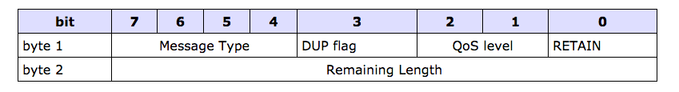
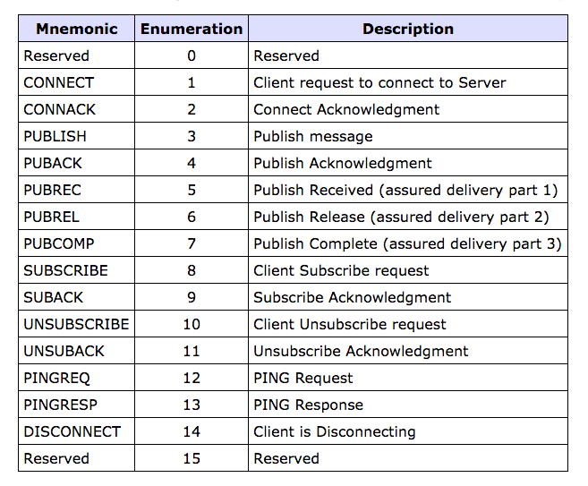
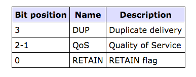
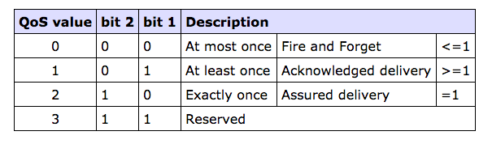

# MQTT 协议说明

原文链接：[MQTT V3.1 Protocol Specification](http://public.dhe.ibm.com/software/dw/webservices/ws-mqtt/mqtt-v3r1.html#flows)

## 摘要

MQTT（`MQ Telemetry Transport`）是一个基于订阅的轻量级消息协议（设计初衷：开放、简单、轻量级、易实现）。而这些特质使得它被使用于一些受约束的环景。例如：

* 网络低带宽、网络不可靠的环境。
* 嵌入于一些受限制的设备（处理器性能较差、内存资源过少）

协议的特点：

* 这种订阅消息模式提供了一对多的消息分配、以及应用的解耦性
* 消息传输过程中的载体都是不可预知的
* 基于TCP/IP
* 提供了三种消息传递的品质
	* `"At most once"`
	* `"At lease once"`
	* `Exactly once`
* 一个小型的传输头部信息、协议交换的信息被压缩到最小、从而降低网络传输流量
* 有一个机制、可以在未知原因导致的断开连接时，广播告诉其他人（遗嘱特色）

## 版权声明

## 目录

## 介绍

协议说明分为三大段落

* 通用于所有数据报类型的消息格式
* 各个数据包类型的特殊详情
* 数据包如何在客户端与服务端进行传输

更多详情请见附录（`如何更通用的使用话题`）

### 演进

介绍 `MQTT V3` 与 `MQTT V3.1` 之间的变化

* 用户的登录名与密码现在已经可以通过连接的数据包进行发送传输。
* 解决了数据包返回code码的加密问题
* 当客户端没有接收到用户认证的通知，那么本应该执行MQTT的命令将不会被执行。
* 字符串在MQTT的可支持`UTF-8`（之前版本支持`US_ASCII`）

协议的版本号会被传递在连接的数据报中，在这次修订中并没有被修正，依然为`"3"`。已存在的MQTT（`V3`）服务器安装启动需要接收支持本地修订的客户端连接，只要当前遵守剩余长度的领域，因此忽略了本次额外的加密信息。

## 消息格式

MQTT的每一个命令消息都包含了一个固定的头信息。一些消息也需要一个可变的头部消息和载体。每个消息头部的格式描述格式如下：

### 固定的头部格式

每一个MQTT的命令消息都包含了一个固定的头部信息，如下表所示：

* Byte1
	* 包含了消息类型、其他标志位（`DUP、QoS Level、RETAIN`）
* Byte2
	* 包含了剩余长度域（至少一个字节）

所有的数据包的值按照大字节存数次序排序：高字节领先于低字节。一个16字节的单词内容在电线中以最有效高位（MSB）传递、紧接着才是最有效低位（LSB）。

#### 消息类型

**Position**：一个字节，7-4

代表`4`字节的无符号数值。 这个版本的协议枚举值如下图所示：

#### 标志位

一个字节的剩余位包含了`DUP、QoS、RETAIN`。这个比特位在编码中，代表的含义如下图所示：

##### DUP

**Position：** 字节1、比特位3

当客户端或者服务端试图去重新发送一个消息。当QoS大于0时，它会申请消息的一个ack回执。当这个`DUP`被设置，可变的头部信息就会包含一个MessageId。

接收者会检测这个标志位、来判断消息是否可能之前被接受过。检测重复的将不被信任。

##### QoS

**Position：** 字节1，比特位2-1

这个标志位表明消息传输的保险等级。QoS等级如下图所示：

##### RETAIN

**Position：** 字节1，比特位0

这个标志位仅用于公有消息。当客户端发送一条发表消息，如果`Retain`标志位设置为1，服务器将会保证这条消息，直到它被发送到当前的订户。

当一个新的订户新建了一个话题，如果设置了这个标志位，那么在这个话题中的最后一条保持消息应该被发送给订户。如果没有保持消息，将不会被发出。

在消息的传递过程中，对于消息的异常报告，他是非常有用的。它允许新的订户立即接收到持有的消息。

当服务器发送一个消息给客户端的时候，
